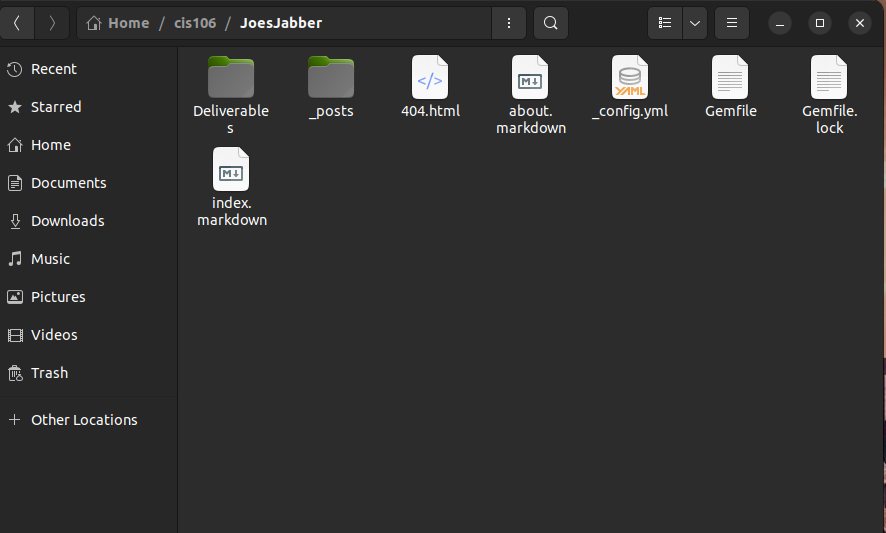
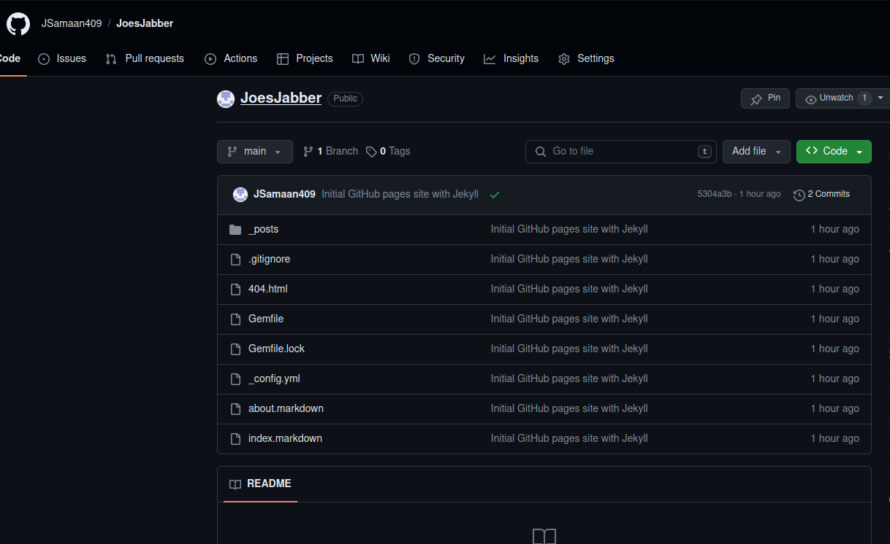
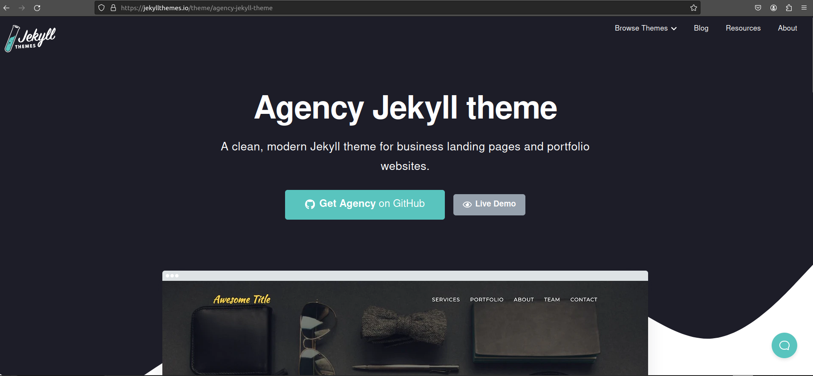
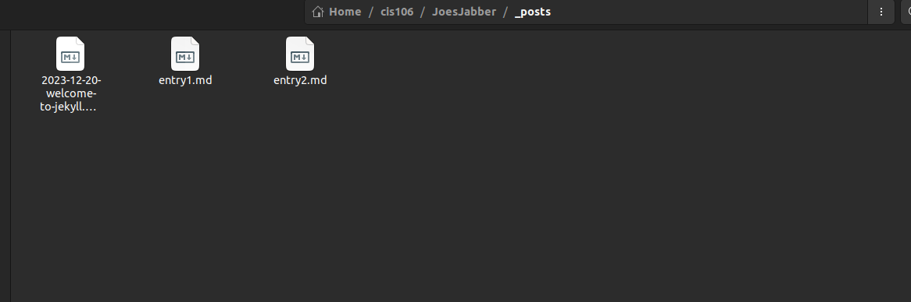

# Deliverable 2

## Steps For Building Blog

1. Since I have Ubuntu on my VM already, I didn't need to download it again. Although I did clone my files to create a second running repository.
2. For the second step I had to install Jekyll onto the VM. In order for you to install Jekyll you need prerequisite files. These files include Ruby and RubyGems. I ran the sudo command and got all my prerequisite files downloaded before going further my Jekyll installation. Then I proceeded using the gem command for installing Jekyll.
 
3. For this step I went onto my Github page and started making a separate repository from our normal cis106 one. I ended up using my name and something I thought would be enjoyable for my blog name. I ended up with JoesJabber as I am the type of person to talk a lot.

4. I then found a template for my website on Jekyll theme's repository option 2 from the links provided.

5. I installed the theme bundle in my terminal and then went into my gem files and config to put the theme on my website.
6. Then I navigated the the posts folder in my JoesJabber folder in order to create markdown files for my blog entry. Once I did that I pushed my entries through.

7. Once all of that was finished I deployed my blog to Github by using the common commands we learned on day one of the class. Pull, add ., commit, push. 